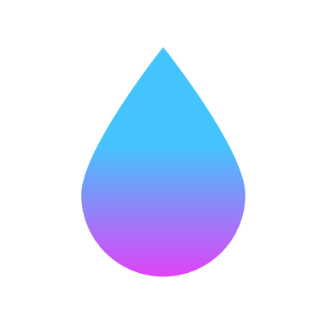

# Awesome Vapor 

[Vapor](https://vapor.codes) is currently one of the most popular server-side Swift frameworks. It allows you to take the language you already know if you ever developed an iOS application and use it in a whole new way, to develop fast, scalable and reliable back-end systems that integrate easily with a wide range of third party services. This is a curated list of:

- modern libraries that easily integrate with Vapor and follow Vapor’s philosophy of providing simple, clean yet powerful APIs;
- well-written tutorials, books, videos and education materials;
- tools to make your development process simpler and more enjoyable;
- and more!

## Contents

- [How to use](#how-to-use)
- [Libraries](#libraries)
- [Tools](#tools)
- [Services](#services)
- [Education](#education)
- [Articles](#articles)
- [Books](#books)
- [Newsletters](#newsletters)
- [Videos](#videos)
- [Open-source Projects](#open-source-projects)
- [License](#license)

## How to use

Simply press <kbd>Command</kbd> + <kbd>F</kbd> to search for a keyword. If you’re only interested in entries related to [Vapor 3](https://github.com/Cellane/awesome-vapor/blob/filtered/vapor-3.md) or only to [Vapor 4](https://github.com/Cellane/awesome-vapor/blob/filtered/vapor-4.md), you may use the automatically generated filtered lists available on the `filtered` branch by visiting the links in this sentence. You may also find the legacy archived content in the `legacy` folder.

## Libraries

-  [SwifQL](https://github.com/MihaelIsaev/SwifQL) – Easily build flexible and type-safe SQL with pure Swift.

## Tools

- [Ether](https://github.com/Ether-CLI/Ether) – A Command-Line Interface for the Swift Package Manager.
- [Heroku buildpack: curl with HTTP/2 support](https://github.com/vzsg/heroku-buildpack-curl-http2)
- [Ice](https://github.com/jakeheis/Ice) – A developer friendly package manager for Swift; 100% compatible with Swift Package Manager.
- [Sourcery](https://github.com/krzysztofzablocki/Sourcery) – Meta-programming for Swift, stop writing boilerplate code.
- [Swifter](https://github.com/LiveUI/Swifter) – A macOS tool to help you manage your Xcode projects and give you a quick access to DerivedData folder cleaning and management.

## Services

- [Vapor Cloud](https://vapor.cloud)
- [Vapor Red](https://vapor.red)

## Education

### Articles

-  [What’s new in Vapor 4?](https://theswiftdev.com/2019/08/26/whats-new-in-vapor-4/)

### Books

### Newsletters

- [VaporNation](http://vapornation.news) – Weekly Vapor newsletter with all things Vapor.

### Videos

## Open-source Projects

## License

To the extent possible under law, _Milan Vit_ has waived all copyright and related or neighbouring rights to this work.
